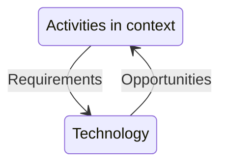

#deb
# 1. An introduction to user experience
- UX - *A person’s perceptions and responses that result from the use or anticipated use of a product, system, or service…*
## 1.1 The variety of UX
Whole environments, not just individual objects
- Ecology - UX is about an *ecology* of devices, not experienced on a single device
## 1.2 The concerns of UX
Key concerns of UX designer:
- *Design*
- *Technologies* - The interactive systems. Know the possibilities
- *People* - Who and how is this used? How will it affect them?
- *Activities and contexts* - What do users want to do and how/where?
### Design
Refers to both the process (designing) and the result (design)
Spectrum from engineering design and creative or artistic design. UX is in the middle somewhere
### People and technologies
*Interactive systems*

### The interface
3 aspects
- Physical - Pressing buttons / moving fingers
- Perceptually - Display on screen / play noise
- Conceptually - Trying to figure pout what the system/service does
UX is about more than simply the interface
### Being human-centred
- Thinking about what people want to do rather than what the technology can do
- Designing new ways to connect people with people
- Involving people in the design process
- Designing for diversity.

## 1.4 The skills of the UX designer

## 1.5 Why being human-centred is important
- ROI
- Safety
	- Humans need to interpret information correctly
- Ethics
	- Are we harming anyone?
	- Intellectual property
- Sustainability
	- Interactive design is consuming. Have impact in mind

# 2 PACT: a framework for designing user experiences
#pact
## 2.1 Introduction
*People use technologies to undertake activities in context* - Benyon 2014

Similar to #factor analysis, but slightly more UX focused. Works like a mission statement.
## 2.2 People
- Physical differences
	- People are different.
		- Handicaps, eyesight, colorblindness
	- Everyone eventually becomes situationaly disabled
		
Ergonomics - relationship between people and environment
People are different and come with different knowledge. Design for lowest denominator
People have different mental models, and a system designed with one but used by another will end up doing something other than what it was designed for. What it does is based on how it is used.
- Mental models are dumb, weird and inconsistent

|     |                          |
| --- | ------------------------ |
| K   | Constant ~100ms          |
| D   | Distance to target in cm |
| S   | Size in cm               |
| T   | Time in seconds          | 

Fitts' law  - $T_{(Time\ to\ move)}=k\cdot log_{2}(\frac{D}{S}+0.5)$

## 2.3 Activities
Focus on overall purpose of activity.
10 important characteristics
- Temporal aspects
	1. Frequency. Frequent tasks should be easier to do and faster, while infrequent should be easy to either learn or remember
	2. Pressure. Something can work well in calm environment, but not when the user is busy
	3. Interruptions. Should be easy to pick back up if often interrupted
	4. Response time. 100ms for hand-eye, 1s for cause-effect, >5s -> frustration
- Cooperation
	5. Alone or group. Issues with comms or coop
- Complexity
	6. Well defined -> step by step. Vague -> let user browse for info
- Safety-critical
	7. How much does mistakes matter? Take it into account
	8. Also generally, outside safety-critical work
- The nature of the content
	9. What tech is needed? Keyboard for large inputs, QR for small. Video vs text for display.
	10. Design around media types and amounts

## 2.4 Contexts
- Physical context
	- Sunshine?
	- Surroundings
- Social context
	- Supportive / competitive / strict
	- Privacy issues
	- Social norms
- Organisational context
	- Does the tech change the org? alter power dynamics or structures?

## 2.5 Technologies
- Input
	- What type of input is available and good here?
		- Writing works with keyboard or stylus but not mouse
	- Is alternate type relevant?
		- Voice
		- Wii pointer
		- Joystick
	- What is important enough to get its own physical button? Abstract this to any other type
- Output
	- Feedback
	- visual / sound / touch
		- TTS / printer / camera projections / haptics
	- What is available and works in context?
		- Visu
- Communication
	- Tlf
	- Ethernet
	- Wifi
	- Bluetooth
	- etc
- Content
	- Accurate, up to date, relevant, well presented
	- Streaming or permanent?

## 2.6 Scoping with PACT
Consider the above points, summarised as:
- **P**eople
	- physical, psychological, social and attitudinal differences
	- Focus on stakeholders (not in the market sense)
- **A**ctivities
	- Complexity, temporal, coop, nature
- **C**ontexts
	- physical, social and organizational setting
- **T**echnologies
	- input, output, communication and content

# 3 The process of human-centred UX design
## 3.1 Introduction
- Users and use. Design is messy

## 3.2 The process of UX design
Can start at any 1 of 3 points, everything is continuously evaluated.

- Understanding
	- What the system/service has to do, what it should feel like and how to fit with other systems.
	- Requirements
		- Functional
			- What to do and how. It should work
		- Non-functional
			- Demonstrated qualities. User should feel it works
- Design
	- Conceptual design
		- What information and functions are needed
		- Conceptualise using rich picture
	- Physical design
		- Translating concept into something real
		- How will it work, look n feel
		- Structure interactions into sequences
		- 3 components
			- Operational - How it works / structure / handling events
			- Representational - layout and style
				- Office/work or playfull?
			- Interaction
				- Responsibility #factor - What is done by tech and what by people
- Envisionment
	- Sketch / prototype / mock-up
	- Show the audience the vision

**Evaluate it all in context**
## 3.3 Developing Personas
Run through the design as various persona and see their reactions / usage. Try how different users would use the product.

Run personas through scenarios

## 3.4 Developing Scenarios
Run through scenarios to see what happens

## 3.5 Using scenarios throughout design

- Stories
	- Real experiences captured in any form
- Conceptual scenarios
	- Details abstracted away to show what we are aiming for
	- Based on multiple stories
	- Find the appropriate abstraction level for the case
- Concrete scenarios
	- More specific situations found from the conceptual scenarios
	- Possibilities start to form the final design
- Use cases
	- Specific use of the system given the formal design

# 4 Cross-channel UX
## 4.1 Introduction
Building experience, not just product. Factor in all possible channels for impressions
- Apple is amazing at this. Everything fits, even web/store/product
Fits with ecologies

## 4.2 The elements of UX

Create wireframe of UI to evaluate

# 5 Usability
- Not accessibility
	- removing excluding barriers
- Usability
	- 
	- Accessibility is a prerequisite
	- Metrics
		- Time to perform task
		- Error count
		- Time to become competent user
- Acceptability 
	- Fitness for purpose in context of use
## 5.2 Accessibility
Legally required
- Physical
	- wheelchair access
	- Screen reader for blind people
- Conceptually
	- Too complicated. Some people are dumb
- Economics
	- Expensiveness excludes
- Cultural
	- Wrong designer assumptions. Metaphors requiring specific cultures
- Social
	- Unavailable at appropriate times or places for social groups

#### Inclusive design
*Total inclusion is often unattainable*
not design-for-all, as that is much larger
- Varying ability is assumed common
- Works for disabled -> works for everyone
- self esteem / well-being based on us functioning
- Usability is compatible with aesthetics

Look at guidelines and include special needs in beta users

Inclusive design is largely just good anyway, since it handles more cases
## 5.3 Usability
- Efficient
- Effective
- Easy to learn and/or remember
- Safe to operate
- High utility

3 principles:
- Early focus on users and tasks
- Empirical meassurement
- Iterative design

Evaluate from #pact