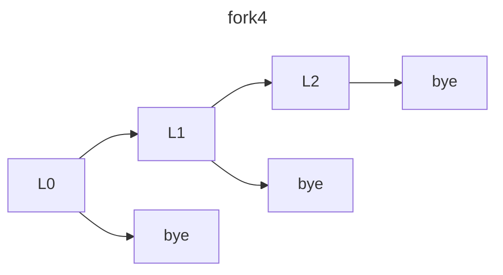
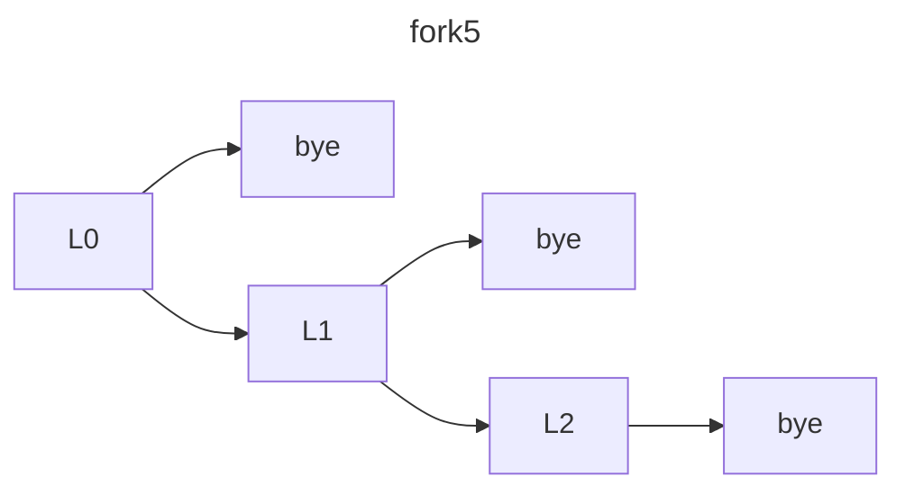

#### Review questions
- Explain the purpose and contents of the process control block 
	- Purpose: Managing information about a single process
	- Contents: /proc/id 
- Explain the difference between the ready state and blocked state. 
	- Ready is waiting for the scheduler to allow processing, while blocked is awaiting another process / syscall
- Explain why the processor needs a a user-mode and a kernel/supervisor mode
	- Security mainly
		- Preventing a single process from stealing cpu time from every other process
		- Isolating processes from the system to dissallow certain operations


| process pair | yes no |
| ------------ | ------ |
| AB           | yes    |
| AC           | no     |
| BC           | yes    |


093636
903636
930636
936036

They interleave because the first process does not wait for the second






Out solution (which works)
```c
#include <stdio.h>
#include <stdlib.h>
#include <sys/wait.h>
#include <unistd.h>

int fib_fork(int n);

int main() {
  int n = 13;
  int res;
  if (fork() == 0) {
    fib_fork(n);
  } else {
    sleep(10);
    int child_pid = wait(&res);
    printf("N: %d\n", n);
    printf("YES: %d\n", WEXITSTATUS(res));
  }
}

int fib_fork(int n) {
  if (n <= 2) {
    exit(1);
  }

  int pids[2];

  for (int i = 0; i < 2; i++) {
    pids[i] = fork();
    if (pids[i] == 0) {
      fib_fork(n - i - 1);
    }
  }

  int res = 0, status;
  while (wait(&status) > 0)
    res += WEXITSTATUS(status);

  sleep(1);
  exit(res);
}
```

```c
#include<stdio.h>
#include<stdlib.h>
#include <unistd.h>
#include <sys/types.h>
#include <sys/wait.h>

//fib(n) = fib(n-1)+fib(n-2)
//fib(0)=0; fib(1)=1
///Only values 0-255 can be transferred using exit as it is normally intended to carry a simple exit code; not the result of a complex computation. 
//For training with fork only: it is hopelessly inefficient as parallelization of fib

int fib(int n) {
  printf("child %d computing %d\n",getpid(),n);
  if(n==0) exit(0);
  if(n==1) exit(1);
  pid_t c1; pid_t c2;

  c1=fork();
  if(c1==0) {
    exit(fib(n-1));
  } else {
    //Parent  
    c2=fork();
    if(c2==0){
       //a CHILD 
        exit( fib(n-2));
    }else{
      //PARENT
      pid_t c1,c2;
      int wStatus1=-1;
      int wStatus2=-1;
      c1=wait(&wStatus1);
      c2=wait(&wStatus2);

      if( ( WIFEXITED(wStatus1) ) && ( WIFEXITED(wStatus2) ) ){
        int exitValue1=WEXITSTATUS(wStatus1);
        int exitValue2=WEXITSTATUS(wStatus2);
	int fib=exitValue1+exitValue2;
        printf("Process %d computed FIB(%d)==%d (got %d from %d and %d from %d)\n",
		getpid(),n, fib, exitValue1, c1, exitValue2,c2);
        exit( fib);
       }
     }
  }
 printf("ONLY Reached if something went wrong!\n");
}

int main(int argc, char* argv[] ) {
 if(argc==2)  
	(void) fib(atoi(argv[1]));
}
```
