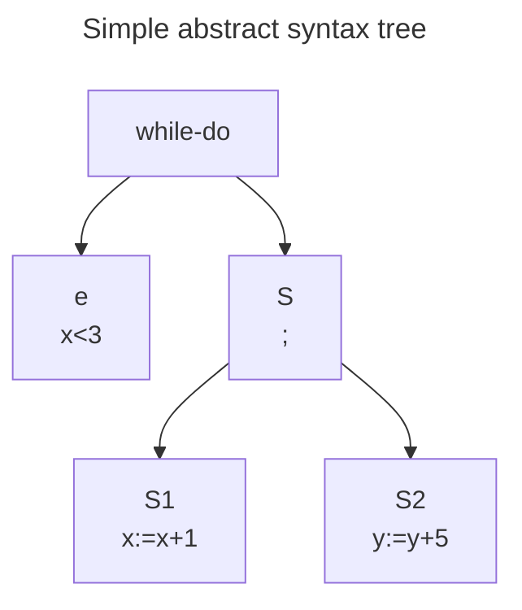

Learning goals:
- To understand the notion of programming paradigm
- To be able to explain the fundamental trade-off in programming language design and implementation
	- Speed vs abstraction, verbosity vs brevity
	- Language design - what is required for the syntax
	- Language implementation - how do we execute it efficiently
- To be able to explain the difference between an interpreter and a compiler
- To understand the notion of abstract syntax
- To be able to define the abstract syntax of a simple language

## Compilers
#itcd/preface
works in multiple phases

| Phase | Description |
| ---- | ---- |
| *Front end* |  |
| Lexical analysis | *lexing* or dividing text into tokens |
| Syntax analysis | create syntax tree from tokens |
| Type checking | Analyse syntax tree for errors |
|  |  |
| *Back end* |  |
| Intermediate code generation | code is translated to simple machine-independent intermediate language |
| Register allocation | variables are translated to numbers referencing registers in target machine code |
| Machine code generation | translate to assembly |
| Assembly and linking | assembly is translated to binary and addresses, functions, etc are determined / linked |

## Interpreters
Works *front end* like compilers, but executes from the syntax tree

## Turing Completeness
*The structured program theorem*: All algorithms can be expressed with only a few simple commands, and control structures
- Sequential composition $S_{1};S_{2}$
- If-then-else commands
- Loop commands

## Syntax

Syntactic categories
$::=$ means "can be"

| Category | Description | Formation rule (Opbygningsregler) |
| ---- | ---- | ---- |
| Exp | Expressions (artihmetic) | $e::=n\mid x\mid e_{1}+e_{2}\mid e_{1}*e_{2}$ |
| Com | Commands (structures) | $S::=x:=e\mid S_{1};S_{2}\mid$ if $e$ then $S_{1}$ else $S_{2}\mid$ while $e$ do $S$ |
½
Defining an abstract syntax is the central part of the syntax

$e$ and $S$ (x:=x+1;y:=y+5) are *immediate constituents* of the while command. $S_{1}$ and $S_{2}$ are *immediate constituents* of the sequential command $S$
