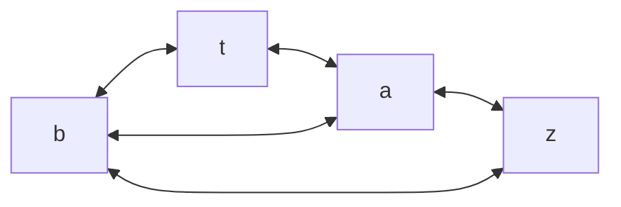
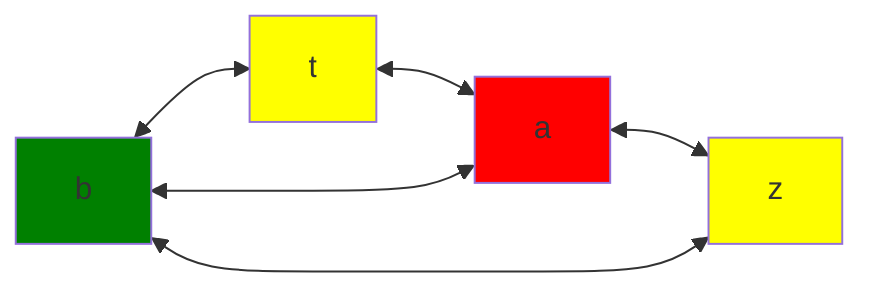

Instructions can trivially be reduced, removing c
1. $gen[1]=Ø$, $kill[1]=a$, $in[1]=\{\}$, $out[1]=\{a\}$
2. $gen[2]=a$, $kill[2]=c$, $in[2]=\{a\}$, $out[2]=\{c\}$
3. $gen[3]=c$, $kill[3]=a$, $in[3]=\{c\}$, $out[3]=\{a\}$
4. $gen[4]=a$, $kill[4]=a$, $in[4]=\{a\}$, $out[4]=\{\}$

1. $gen=\{\}$$kill=\{\}$$succ=\{2\}$
2. $gen=\{a,b\}$$kill=\{\}$$succ=\{3,7\}$
3. $gen=\{\}$$kill=\{\}$$succ=\{4\}$
4. $gen=\{a\}$$kill=\{t\}$$succ=\{5\}$
5. $gen=\{b\}$$kill=\{a\}$$succ=\{6\}$
6. $gen=\{t\}$$kill=\{b\}$$succ=\{7\}$
7. $gen=\{\}$$kill=\{\}$$succ=\{8\}$
8. $gen=\{\}$$kill=\{z\}$$succ=\{9\}$
9. $gen=\{a,b\}$$kill=\{b\}$$succ=\{10\}$
10. $gen=\{b,z\}$$kill=\{\}$$succ=\{11,1\}$
11. $gen=\{\}$$kill=\{\}$$succ=\{12\}$
12. $gen=\{a\}$$kill=\{\}$$succ=\{\}$

|     | Iteration 1 |       | Iteration 2 |       | Iteration 3 |       |
| --- | ----------- | ----- | ----------- | ----- | ----------- | ----- |
|     | in          | out   | in          | out   | in          | out   |
| 1   | a,b         | a,b   | a,b         | a,b   | a,b         | a,b   |
| 2   | a,b         | a,b   | a,b         | a,b   | a,b         | a,b   |
| 3   | a,b         | a,b   | a,b         | a,b   | a,b         | a,b   |
| 4   | a,b         | b,t   | a,b         | b,t   | a,b         | b,t   |
| 5   | b,t         | t,a   | b,t         | t,a   | b,t         | t,a   |
| 6   | t,a         | a,b   | t,a         | a,b   | t,a         | a,b   |
| 7   | a,b         | a,b   | a,b         | a,b   | a,b         | a,b   |
| 8   | a,b         | a,b,z | a,b         | a,b,z | a,b         | a,b,z |
| 9   | a,b,z       | b,z,a | a,b,z       | b,z,a | a,b,z       | b,z,a |
| 10  | b,z,a       | a     | b,z,a       | a,b   | b,z,a       | a,b   |
| 11  | a           | a     | a           | a     | a           | a     |
| 12  | a           |       | a           |       | a           |       |

| Instr | Kill | out   | Interferens  |
| ----- | ---- | ----- | ------------ |
| 4     | t    | t,b   | (t,b)        |
| 5     | a    | t,a   | (a,t)        |
| 6     | b    | a,b   | (a,b)        |
| 8     | z    | a,b,z | (z,a), (z,b) |
| 9     | b    | b,z,a | (b,z), (b,a) |

colour t and z the same

Grafer hvis cykluser alle består af et lige antal forbindelse
- Proof by reader exercise
