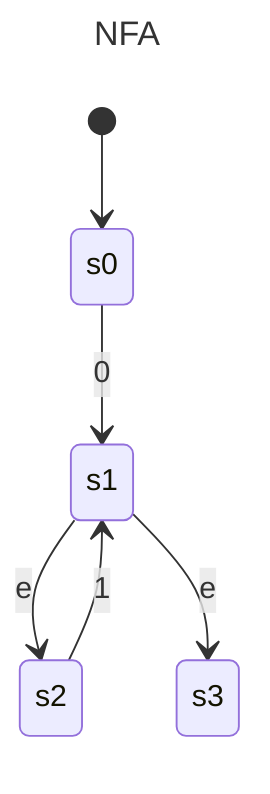
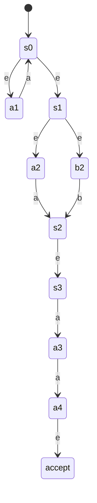
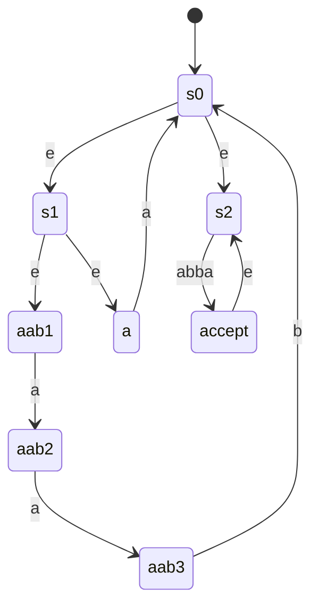

## Preparation
1.
$\epsilon|1|1[01]*1$

## Exercise 1
rewrite $(a|b)(c|d)\epsilon$ to prove $ac\in L(s)$
$(\mathtt{a}|\mathtt{b})(\mathtt{c}|\mathtt{d})\epsilon$
$\mathtt{a}(\mathtt{c}|\mathtt{d})\epsilon$
$\mathtt{a}\mathtt{c}\epsilon$
$\mathtt{a}\mathtt{c}$

$L(s)=\{ac,ad,bc,bd\}$

## Exercise 2
1. $0*17$
2. $0*([0-9]   |   (1([0-689])   |  ([2-9][0-9])   |  ([1-9][0-9][0-9]+))$
		$\^(0*17)$
	   divides into three cases depending on number of digits
3. $0*((1([89])   |  ([2-9][0-9])   |  ([1-9][0-9][0-9]+))$
## Exercise 3

## Exercise 4
Antallet af tilstande per konstruktion er constant, så den er linear

## Extra

**a.**
$[\_a-zA-Z][0-9a-zA-Z]^*(.[\_a-zA-Z][0-9a-zA-Z]^*)^*$

**b.**
$(\mathtt{a}|\mathtt{aab})*(\mathtt{abba})+$

