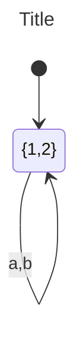
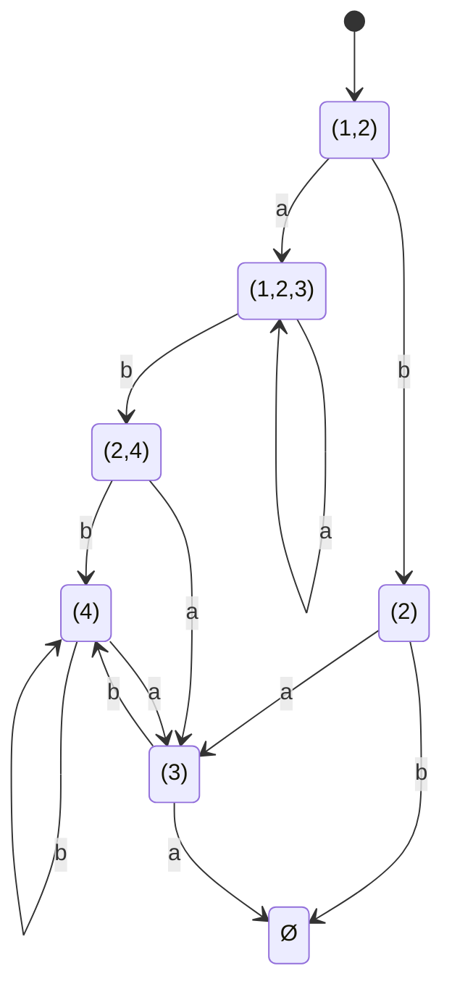
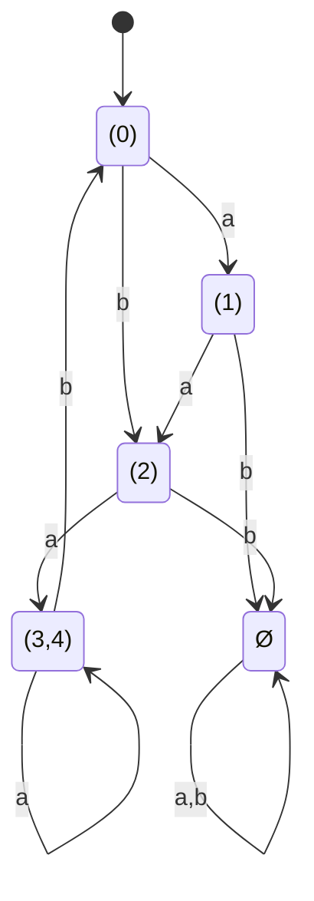
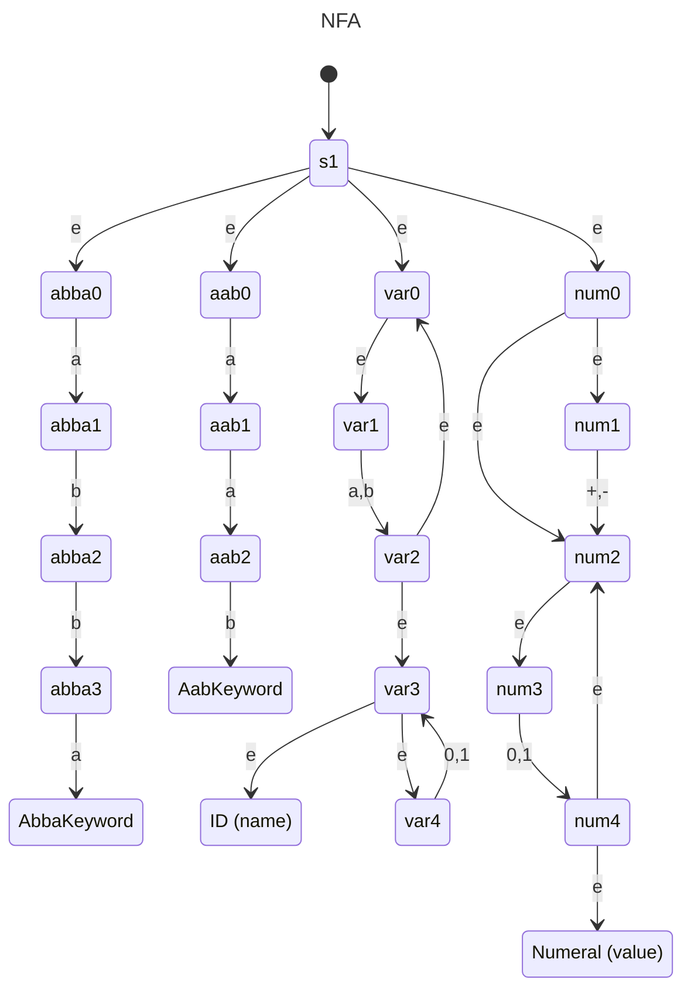
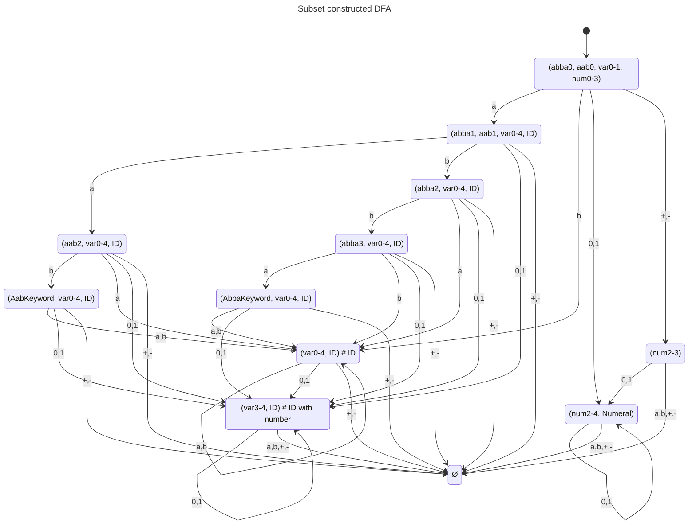
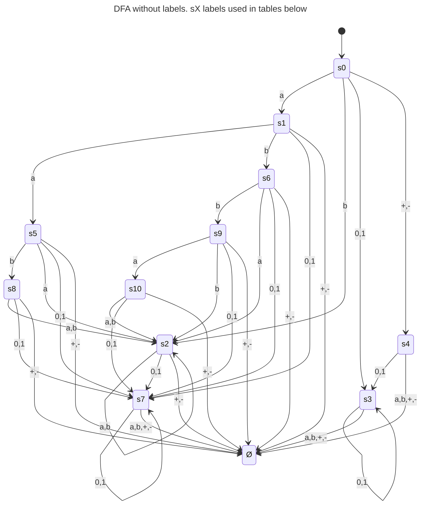
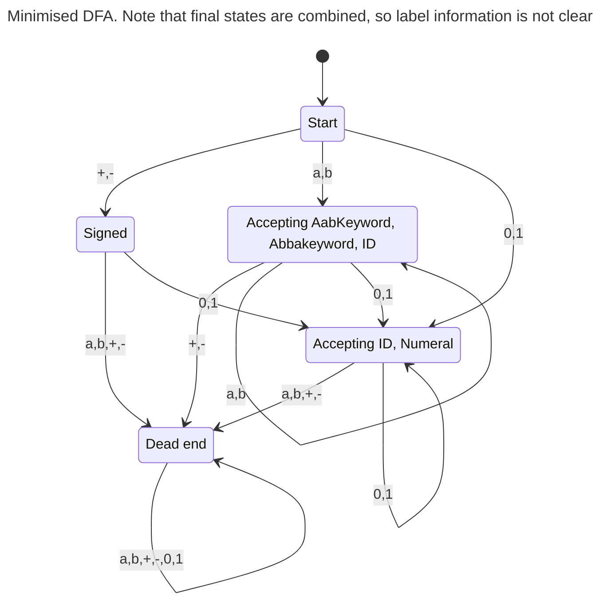

## Preparation

#### Ex1
$\{1,2\}$

#### Ex2
Nope, influencer is dumb dumb.

#### Ex 3

## Class

#### Ex 1

where $F=\{\{2,4\}\{4\}\}$
#### Ex2
Nope, influencer is dumb dumb.

#### Ex 3

#### Ex 4
- regex to tokens
	- $\texttt{abba}\rightarrow$ keyword
	- $\texttt{aab}\rightarrow$ keyword
	- `[ab]+[01]*` -> ID {name}
	- `[+-]?[01]+` -> Numeral {value}
- Use Lexer generator to build NFA
- Or create NFA union of regexes with labeled final states
- NFA $\rightarrow$ DFA

#### 4.1 Build it

$G1=\{s0,s4,Ø\}$
$G2=\{s1,s2,s3,s5,s6,s7,s8,s9,s10\}$

| $G1$ | a | b | 0,1 | +,- |
| ---- | ---- | ---- | ---- | ---- |
| s0 | 2 | 2 | 2 | 1 |
| s4 | 1 | 1 | 2 | 1 |
| Ø | 1 | 1 | 1 | 1 |
$G2=\{s1,s2,s3,s5,s6,s7,s8,s9,s10\}$
$G3=\{s0\}$
$G4=\{s4\}$
$G5=\{Ø\}$

| $G2$ | a | b | 0,1 | +,- |
| ---- | ---- | ---- | ---- | ---- |
| s1 | 2 | 2 | 2 | 5 |
| s2 | 2 | 2 | 2 | 5 |
| s3 | 5 | 5 | 2 | 5 |
| s5 | 2 | 2 | 2 | 5 |
| s6 | 2 | 2 | 2 | 5 |
| s7 | 5 | 5 | 2 | 5 |
| s8 | 2 | 2 | 2 | 5 |
| s9 | 2 | 2 | 2 | 5 |
| s10 | 2 | 2 | 2 | 5 |
$G3=\{s0\}$
$G4=\{s4\}$
$G5=\{Ø\}$
$G6=\{s1,s2,s5,s6,s8,s9,s10\}$
$G7=\{s3,s7\}$

| $G3$ | a | b | 0,1 | +,- |
| ---- | ---- | ---- | ---- | ---- |
| s0 | 6 | 6 | 7 | 4 |

| $G4$ | a | b | 0,1 | +,- |
| ---- | ---- | ---- | ---- | ---- |
| s4 | 5 | 5 | 7 | 5 |

| $G5$ | a | b | 0,1 | +,- |
| ---- | ---- | ---- | ---- | ---- |
| Ø | 5 | 5 | 5 | 5 |

| $G6$ | a | b | 0,1 | +,- |
| ---- | ---- | ---- | ---- | ---- |
| s1 | 6 | 6 | 7 | 5 |
| s2 | 6 | 6 | 7 | 5 |
| s5 | 6 | 6 | 7 | 5 |
| s6 | 6 | 6 | 7 | 5 |
| s8 | 6 | 6 | 7 | 5 |
| s9 | 6 | 6 | 7 | 5 |
| s10 | 6 | 6 | 7 | 5 |

| $G7$ | a | b | 0,1 | +,- |
| ---- | ---- | ---- | ---- | ---- |
| s3 | 5 | 5 | 7 | 5 |
| s7 | 5 | 5 | 7 | 5 |

## Extra
#### A
Step 1
