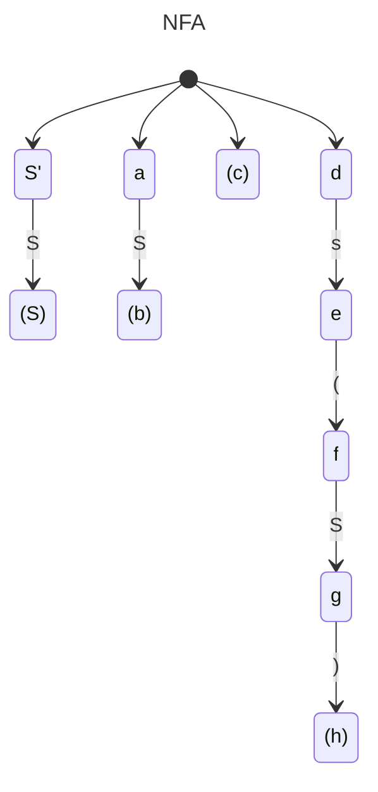
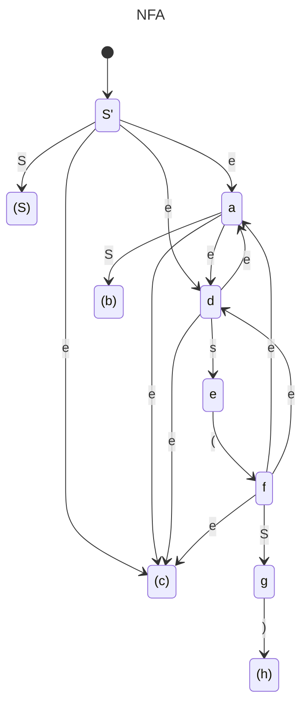
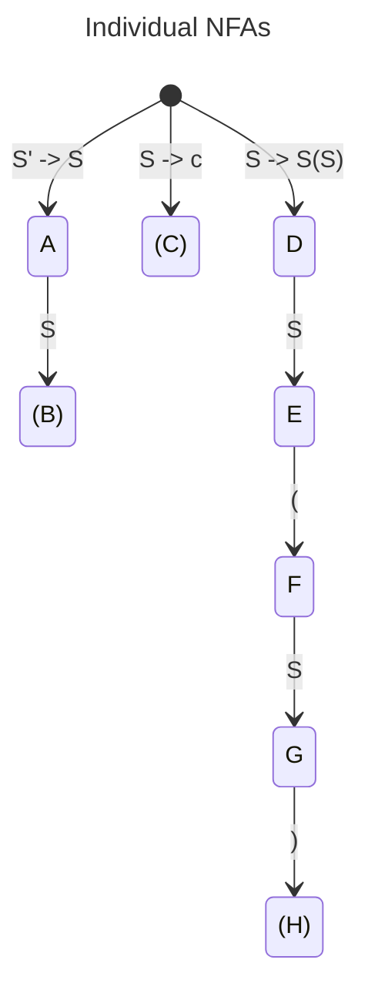
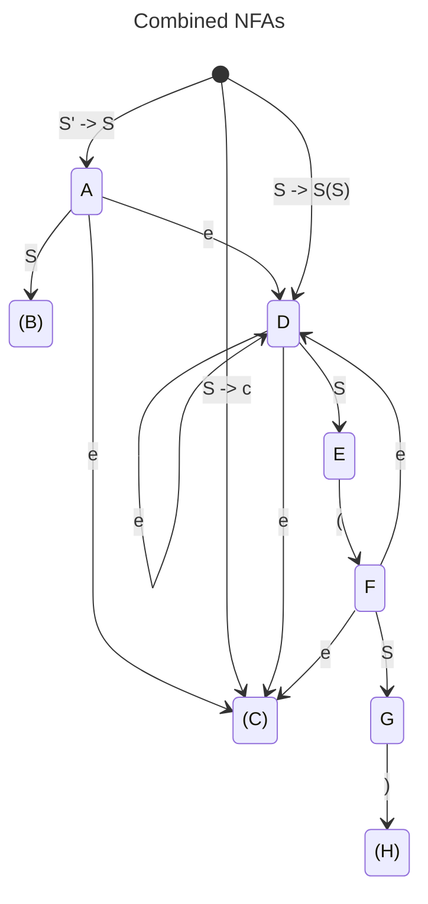
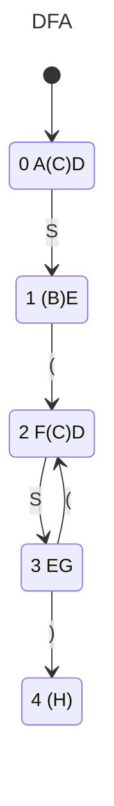

## Prep
1. 
*Billede er lidt småt. Har hurtigt sat det ind før jeg sendte dette dokument*

| Stack | input | action                         |
| ----- | ----- | ------------------------------ |
|       | aabaa | shift 3 times                  |
| aab   | aa    | reduce with $S\rightarrow b$   |
| aaS   | aa    | shift 1 time                   |
| aaSa  | a     | reduce with $S\rightarrow aSa$ |
| aS    | a     | shift 1 time                   |
| aSa   |       | reduce with $S\rightarrow aSa$ |
| S     |       |                                |
2. 

***New solution during exam-prep***

| Stack   | Input | Action                                                      |
| ------- | ----- | ----------------------------------------------------------- |
| 0       | abc$  | shift go to 3                                               |
| 0a3     | bc$   | shift go to 4                                               |
| 0a3b4   | c$    | reduce rule 3.  Adds R to get 0a3b4R 4R means go to 6 |
| 0a3b4R6 | c$    | reduce rule 4 gives 0a3R 3R means go to 2             |
| 0a3R2   | c$    | r1                                                          |
| 0a3T5   | c$    | s7                                                          |
| 0a3T5c7 | $     | r2                                                          |
| 0T1     | $     | accept                                                      |

| Stack   | input | action                                                                                                            |
| ------- | ----- | ----------------------------------------------------------------------------------------------------------------- |
| 0       | abc   | s3                                                                                                                |
| 0a3     | bc    | s4                                                                                                                |
| 0a3b4   | c     | r3$(R\rightarrow)$ reduces nothing because empty right-hand side; Then go with 4$R$ (g6), pushing $R$ 6 to stack. |
| 0a3b4R6 | c     | r4$(R\rightarrow bR)$ reduces $b4R6$, then with 3$R$ action is g2, pushing R2 to stack                            |
| 0a3R2   | c     | r1$(T\rightarrow R)$ reduces $R2$, then with 3T action is g5, pushing T5 to stack                                 |
| 0a3T5   | c     | s7                                                                                                                |
| 0a3T5c7 |       | r2$(T\rightarrow aTc)$ then g1                                                                                    |
| 0T1     |       | accept                                                                                                            |
## Session
#### 1
###### 1.1
$S'\rightarrow S\$$
$S\rightarrow\epsilon|S(S)$
The NFA's below are slightly wrong, as the initial state has been duplicated
I confused myself in my naming.
*NFA'en Markus Dam tegnede på tavlen var korrekt, og den følgende DFA er dannet fra.*

###### 1.2
*Tak til Markus Dam for pæn DFA. Denne er korrekt.*

#### 1.3
States are numbered left to right in the DFA

| State | contains | (   | )   | \$  | S   |
| ----- | -------- | --- | --- | --- | --- |
| 0     | acd      |     |     |     | g1  |
| 1     | be       | s2  |     |     |     |
| 2     | fcd      |     |     |     | g3  |
| 3     | eg       | s2  | s4  |     |     |
| 4     | h        |     |     |     |     |
###### 1.4
List rules again for clarity, and give them numbers for use in r$x$ actions
0. $S''\rightarrow S'\$$
1. $S'\rightarrow S$
2. $S\rightarrow\epsilon$
3. $S\rightarrow S(S)$
*Det er muligt det ovenstående er lidt anderledes end hvad bogen skriver, men det er vidst bare at kalde reglerne 0-2, og ikke nummerere $S''$*

Computing follow for non-terminals
$FOLLOW(S'')=\{\}$
$FOLLOW(S')=\{\$\}$
$FOLLOW(S)=\{\$,(,)\}$

| State | contains                     | (   | )   | \$          | S   |
| ----- | ---------------------------- | --- | --- | ----------- | --- |
| 0     | acd (c is accept)            | r2  | r2  | r2          | g1  |
| 1     | be (b is accept)             | s2  |     | r0 = accept |     |
| 2     | fcd (c is accept)            | r2  | r2  | r2          | g3  |
| 3     | eg (no accept, so no reduce) | s2  | s4  |             |     |
| 4     | h (h is accept)              | r3  | r3  | r3          |     |
r0 is accept because it reduces on $S'$
###### 1.5
parse the input (())

*Undskyld til folket, ingen beskrivelser på skridt herunder. Send en PM på discord hvis jeg skal uddybe.*

| Stack         | Input | Action |
| ------------- | ----- | ------ |
| 0             | (())$ | r2; g1 |
| 0S1           | (())$ | s2     |
| 0S1(2         | ())$  | r2; g3 |
| 0S1(2S3       | ())$  | s2     |
| 0S1(2S3(2     | ))$   | r2; g3 |
| 0S1(2S3(2S3   | ))$   | s4     |
| 0S1(2S3(2S3)4 | )$    | r3; g3 |
| 0S1(2S3       | )$    | s4     |
| 0S1(2S3)4     | $     | r3; g1 |
| 0S1           | $     | accept |

## Exam prep

$S'\rightarrow S\$$
$S\rightarrow\epsilon|S(S)$

Combine on non-terminals, so each non-terminal epsilons to productions from that non-terminal

| State | Contains | (   | )   | \$  | S   |
| ----- | -------- | --- | --- | --- | --- |
| 0     | A(C)D    |     |     |     | g1  |
| 1     | (B)E     | s2  |     |     |     |
| 2     | F(C)D    |     |     |     | g3  |
| 3     | EG       | s2  | s4  |     |     |
| 4     | (H)      |     |     |     |     |

$S''\rightarrow S'\$$
0. $S'\rightarrow S$
1. $S\rightarrow\epsilon$
2. $S\rightarrow S(S)$

$Nullable(S'')=false$
$Nullable(S')=Nullable(S)=true$
$Nullable(S)=true$
$First(S'')=First(S')\cup \{\$\}=\{(,\$\}$
$First(S')=First(S)=\{(\}$
$First(S)=\{(\}$

Follow in steps
$Follow(S'')=Ø$
$Follow(S')=\{\$\}$
$Follow(S)=\{(,)\}$

$Follow(S'')=Ø$
$Follow(S')=\{\$\}$
$Follow(S)=\{\$,(,)\}$

Write productions again, but linked to the name of their accepting initial NFA state. Then use this to link accepting state in table to which rule should reduce

i.e. C corresponds to rule 1 with right-hand-side $S$, so if a state/row contains C, add `r1` to columns in $Follow(S)$

$S''\rightarrow S'\$$
0. $B: S'\rightarrow S$
1. $C:S\rightarrow\epsilon$
2. $H:S\rightarrow S(S)$

| State | Contains | (   | )   | \$  | S   |
| ----- | -------- | --- | --- | --- | --- |
| 0     | A(C)D    | r1  | r1  | r1  | g1  |
| 1     | (B)E     | s2  |     | r0  |     |
| 2     | F(C)D    | r1  | r1  | r1  | g3  |
| 3     | EG       | s2  | s4  |     |     |
| 4     | (H)      | r2  | r2  | r2  |     |

| Stack         | Input | Action       |
| ------------- | ----- | ------------ |
| 0             | (())$ | r1;g1        |
| 0S1           | (())$ | s2           |
| 0S1(2         | ())$  | r1;g3        |
| 0S1(2S3       | ())$  | s2           |
| 0S1(2S3(2     | ))$   | r1;g3        |
| 0S1(2S3(2S3   | ))$   | s4           |
| 0S1(2S3(2S3)4 | )$    | r2;g3        |
| 0S1(2S3       | )$    | s4           |
| 0S1(2S3)4     | $     | r2;g1        |
| 0S1           | $     | r0 // Accept |
