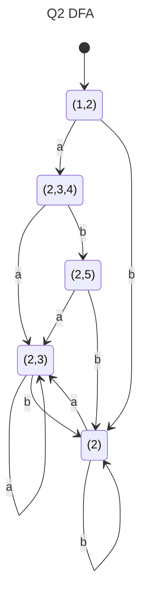

Q1 should only have 1 parenthesis at the end

Solution doesn't have {2} in aab, only 2

|     | N?    | N?    | N?    |
| --- | ----- | ----- | ----- |
| A   | false | false | false |
| B   | false | true  | true  |
| C   | false | false | false |

$First(A)=\{x\}$
$First(B)=\{z\}$
$First(C)=\{y,z,x\}$

$Follow(A)=\{\}$
$Follow(B)=\{x,y\}$
$Follow(C)=\{z\}$

$Follow(A)=\{\}$
$Follow(B)=\{x,y\}$
$Follow(C)=\{z,y\}$

There is a non-sensical sentence (option 3). Hopefully it is not the answer meant to be correct.

| Line | Succ | Gen | Kill |     | In  | Out | In  | Out |
| ---- | ---- | --- | ---- | --- | --- | --- | --- | --- |
| 1    | 2    | Ø   | x    |     | Ø   | x   | Ø   | x   |
| 2    | 3    | Ø   | y    |     | x   | x,y | x   | x,y |
| 3    | 4    | x,y | x    |     | x,y | x,y | x,y | x,y |
| 4    | 3,5  | y   | Ø    |     | x,y | x,y | x,y | x,y |
| 5    | 6    | x   | z    |     | x,y | y,z | x,y | y,z |
| 6    | Ø    | y,z | y    |     | y,z | Ø   | y,z | Ø   |

