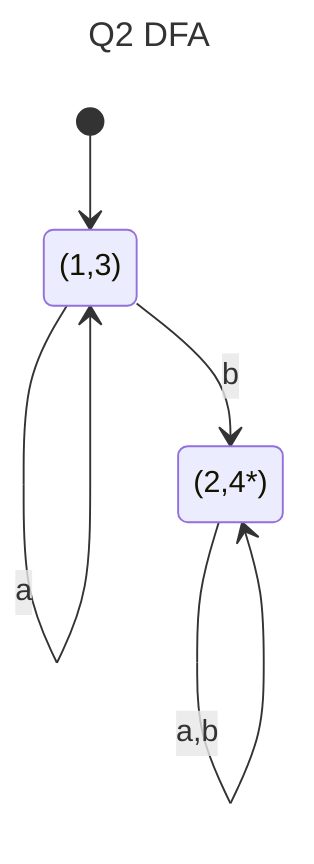

## Q6 Liveness

|     | suc | gen | kill |     | in  | out | in  | out |
| --- | --- | --- | ---- | --- | --- | --- | --- | --- |
| 1   | 2   | Ø   | x    |     | Ø   | x   | Ø   | x   |
| 2   | 3   | x   | y    |     | x   | x,y | x   | x,y |
| 3   | 4,5 | x,y | Ø    |     | x,y | x   | x,y | x   |
| 4   | 5   | Ø   | z    |     | x   | x   | x   | x   |
| 5   | Ø   | x   | z    |     | x   | Ø   | x   | Ø   |

