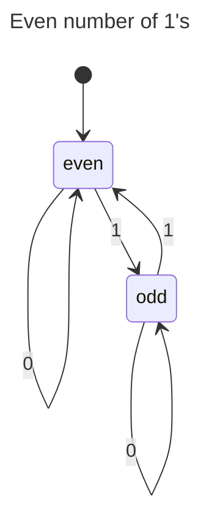
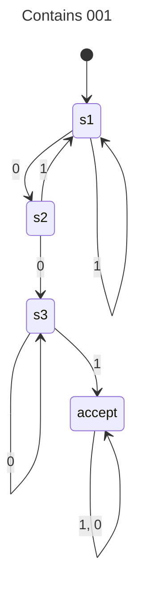

## Lecture Game

## Ex 1
$L_{1}=\{aa,bb,bbb\}$
$L_{2}=\{abba,aab,bb\}$
$\sum=\{a,b\}$

|  |  |
| ---- | ---- |
| 1 | aaabba aaaab aabb ... |
| 2 | aa,bb,bbb abba,aab |
| 3 | bb |
| 4 | abbaabbaabbaabba bbbbbbbbbbbb |
## Ex 2

1.a
q1-q2-q3^4

1.b
q1-q2-q3^x

1.c
-||-

1.d
q1

2
d is accepted by m2 and m3

3
$L(M_{1})=\{xa | x \in \{b\}^{*}\}$
$L(M_{2})=\{b\}^{*}$
$L(M_{3})=L(M_{1})\cup L(M_{2})$
## Ex 3
$L(M_{4})=\{xwx|x\in\Sigma\land w\in\Sigma^{*}\}\cup\{a,b\}$

## Ex 4
se tavle

## Ex 5
1.
L2 from before

2.a
$M_{2}$
$M_{1}$
q0 - accept

## Ex 6

$F=(F_{A}\times F_{B})$

Next we prove that $L(M)=L(M_{A})\cap L(M_{B})$

$(\subseteq)$
let $w\in L(M)$ and $(q_{1}, r_{1})\dots(q_{n},r_{n})$ be the accepting sequence for $w$ in $M$.
By constructing $(q_{n},r_{n})\in(F_{A}\times F_{B})$. 
Therefore, $q_{n}\in F_{A}\land r_{n}\in F_{B}$.
Moreover, $q_{1}=q_{0}^{A}$ and $r_{1}=q_{0}^{B}$
By definition of $\delta$ , for each ... $\delta_{A}(q_{i},a_{i+1})=q_{i+1}$ and similar for B
By noting that the sequences $q_{1},\dots,q_{n}$ and r... are accepting in $M_{A}$ and $M_{B}$ we conclude $w\in L(M_{A})\cap L(M_{B})$ 

$(\supseteq)$
Assume $w\in L(M_{A})\cap L(M_{B})$, therefore $w\in L(M_{A})$ and $w\in L(M_{B})$. 
Let $q_{1}\dots q_{n}$ be the accepting sequence for $w$ in $M_{A}$. Similarly $r_{1}\dots r_{n}$ is the accepting sequence for $w$ in $M_{B}$
By construction, the computation for $w$ in $M$ is of the form $(q_{1}, r_{1})\dots(q_{n},r_{n})$.
Since $q_{n}\in F_{A}\land r_{n}\in F_{B}$, then $(q_{n}, r_{n})\in F$
Therefore $w\in L(M)$

Given the two above conclusions, $A\cap B$ is regular.

## Ex 7
- Accepted
	- 0
	- 10102102 reset
	- 222
	- 12
	- 111
- Rejected
	- 22
	- 11
	- 20
	- 543243132525232 reset 2

Proof by strong induction:

base case:
$count(0)=0\mod3$
$count(1)= 1 \mod 3$
$count(2)= 2 \mod 3$

The first of these is accepted, as 0 leads to $q_{0}$. The others are not, as they lead to $q_{1}$ and $q_{2}$ respectively.

p(n)=